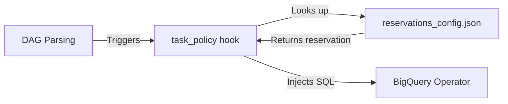

# Airflow Reservations Policy

Airflow Cluster Policy plugin for automatic BigQuery reservation management.

This package integrates with Airflow's [Cluster Policies](https://airflow.apache.org/docs/apache-airflow/stable/administration-and-deployment/cluster-policies.html) to automatically inject BigQuery reservation assignments into your tasks without requiring any changes to your DAG code.

## Features

- **Automatic Injection** - Intercepts `BigQueryInsertJobOperator` and `BigQueryExecuteQueryOperator` tasks
- **Lookup-based Configuration** - Uses `dag_id.task_id` → `reservation_id` mappings
- **Python API** - Provides `get_reservation()` for custom BigQuery API calls in PythonOperators
- **Performance Optimized** - Config caching with file mtime-based invalidation
- **Graceful Error Handling** - Won't crash Airflow on config errors

## Installation

```bash
pip install airflow-reservations-policy
```

Or add to your `requirements.txt`:

```text
airflow-reservations-policy>=0.1.0
```

The policy is automatically registered via Airflow's plugin entrypoint system (requires Airflow 2.6+).

## Configuration

Create a `reservations_config.json` file in your DAGs folder:

```json
{
  "reservation_config": [
    {
      "tag": "standard",
      "reservation": "projects/{project}/locations/{location}/reservations/{name}",
      "tasks": [
        "finance_dag.daily_report",
        "etl_dag.load_analytics"
      ]
    },
    {
      "tag": "on_demand",
      "reservation": "none",
      "tasks": [
        "adhoc_dag.quick_query"
      ]
    },
    {
      "tag": "default",
      "reservation": null,
      "tasks": [
        "marketing_dag.calculate_roas"
      ]
    }
  ]
}
```

### Configuration Fields

| Field         | Description                                    |
| ------------- | ---------------------------------------------- |
| `tag`         | Human-readable label for the reservation group |
| `reservation` | See values below                               |
| `tasks`       | Array of `"dag_id.task_id"` patterns           |

**Reservation values:**

| Value                             | Behavior                                                                     |
| --------------------------------- | ---------------------------------------------------------------------------- |
| `"projects/.../locations/.../reservations/..."` | Injects that reservation into the SQL                                        |
| `"none"`                          | Injects `SET @@reservation_id = 'none';` (explicitly use on-demand capacity) |
| `null`                            | Skips the task entirely (no SQL modification)                                |

### Configuration Path

By default, the config file is loaded from `$AIRFLOW_HOME/dags/reservations_config.json`.

Override the path using the `RESERVATIONS_CONFIG_PATH` environment variable:

```bash
export RESERVATIONS_CONFIG_PATH=/custom/path/to/config.json
```

### TaskGroups and Dynamic Tasks

For tasks inside TaskGroups, use the full task ID path as it appears in Airflow:

```json
{
  "reservation_config": [
    {
      "tag": "standard",
      "reservation": "projects/{project}/locations/{location}/reservations/{name}",
      "tasks": [
        "my_dag.my_task_group.inner_task"
      ]
    }
  ]
}
```

## How It Works

When Airflow parses your DAGs, this plugin's `task_policy` hook is called for each task. For BigQuery tasks, it:

1. Extracts `dag_id` and `task_id` from the task
2. Looks up `dag_id.task_id` in the configuration file
3. If found, prepends `SET @@reservation_id = '...';` to the SQL query



## Usage in Python Operators

For custom BigQuery API calls in `PythonOperator`, use the provided API:

```python
from airflow_reservations_policy import get_reservation

def my_bigquery_task(**context):
    dag_id = context['dag'].dag_id
    task_id = context['task'].task_id

    # Look up reservation for this task
    reservation = get_reservation(dag_id, task_id)

    if reservation:
        # Prepend to your SQL
        sql = f"SET @@reservation_id = '{reservation}';\n{your_sql}"
    else:
        sql = your_sql

    # Execute with BigQuery client...
```

### API Reference

#### `get_reservation(dag_id: str, task_id: str) -> str | None`

Look up the reservation ID for a specific task.

```python
from airflow_reservations_policy import get_reservation

reservation = get_reservation("my_dag", "my_task")
# Returns: "projects/my-project/locations/US/reservations/my-res" or None
```

#### `load_config(force_reload: bool = False) -> dict`

Load the full configuration dictionary.

```python
from airflow_reservations_policy import load_config

config = load_config()
# Returns: {"reservations": {...}}
```

## Generating Configuration

Use Masthead recommendations to generate the `reservations_config.json` file containing the optimal reservation assignments for your tasks. Users are responsible for pulling this configuration into their Airflow environment.

Typical workflow:

1. Masthead analyzes your BigQuery workloads
2. Read Masthead recommendations and generate `reservations_config.json` with optimal assignments
3. Merge the config into your DAGs repository
4. Airflow syncs the updated config file
5. The policy automatically applies reservations on next task parse

## Troubleshooting

### Config not loading

Check that:

1. The config file exists at the expected path
2. The file contains valid JSON
3. Airflow has read permissions

Enable debug logging:

```python
import logging
logging.getLogger("airflow_reservations_policy").setLevel(logging.DEBUG)
```

### Reservations not being applied

Verify:

1. The task type is `BigQueryInsertJobOperator` or `BigQueryExecuteQueryOperator`
2. The `dag_id.task_id` key exactly matches the config
3. For TaskGroups, include the full path (e.g., `dag.group.task`)

## Development

```bash
# Install dev dependencies
pip install -e ".[dev]"

# Run unit tests
pytest tests/ -v

# Run with coverage
pytest tests/ --cov=airflow_reservations_policy

# Run E2E tests (requires Docker)
./e2e/run_test.sh

# Run E2E tests with Airflow 2.x
make e2e-airflow2

# Run E2E tests with Airflow 3.x
make e2e-airflow3

# Run E2E tests with all supported Airflow versions
make e2e-all
```

## Supported Versions

This package is tested and compatible with:
- **Airflow 2.6+** (including 2.10.x) - ✅ Fully supported and tested
- **Airflow 3.x** (including 3.1.x) - ⚠️ Plugin installs but Task SDK requires additional configuration (see notes below)
- **Python 3.8+** (tested with 3.11 and 3.12)

The plugin uses Airflow's standard [Cluster Policies](https://airflow.apache.org/docs/apache-airflow/stable/administration-and-deployment/cluster-policies.html) API, which is stable across these versions.

### Airflow 3.x Status

Airflow 3.x introduces significant architectural changes, particularly the new Task SDK and API-based task execution model.

**What Works:**
- ✅ Plugin installation and registration
- ✅ Policy hook execution (task_policy called correctly)
- ✅ Reservation injection logic
- ✅ Configuration loading and validation
- ✅ DAG parsing with deprecation warnings (uses old import paths)

**Known Issues:**
- ❌ Task execution fails with Task SDK API communication errors
- ❌ E2E tests do not complete (tasks stay in queued state or fail)
- ⚠️ Import deprecation warnings: `airflow.models.baseoperator.BaseOperator` and `airflow.utils.task_group.TaskGroup` are deprecated in favor of SDK equivalents

**Root Cause:**
Airflow 3.x's Task SDK requires tasks to communicate with the API server during execution. This adds complexity to the deployment setup that goes beyond the plugin itself. The configuration requires:
- Properly configured `AIRFLOW__CORE__INTERNAL_API_URL`
- Network accessibility between task execution environment and API server
- Correct authentication setup for internal API calls

**Recommendation:**
For production use, we recommend Airflow 2.10.x which has been thoroughly tested. Airflow 3.x support will be improved as the new architecture stabilizes and best practices emerge.
- Command changes: `airflow webserver` → `airflow api-server`
- Health endpoint: `/health` → `/api/v2/monitor/health`
- API configuration may require `AIRFLOW__API__ENDPOINT_URL` setting
- Import paths have deprecation warnings (functionality still works)

**Testing Status:**
- Unit tests: ✅ Pass (28/28)
- E2E tests (Airflow 2.x): ✅ Pass (5/5)
- E2E tests (Airflow 3.x): ⚠️ In progress

For production deployments with Airflow 3.x, please conduct thorough testing in your specific environment first.
